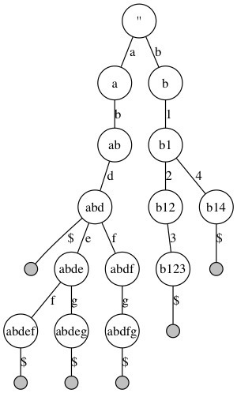
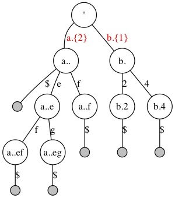

### How Node.squash works

#### How trie looks like

There is an example trie of 6-keys:

keys:
```
abd
abdef
abdeg
abdfg
b123
b14
```

trie:

**leaf-Node** use a dark color, **mid-Node** use a light color.



There are some nodes that are both leaf-Node and mid-Node.

To simplify, we add an extra '$' branch used to lead to a value in our trie implement,
thus we can divided nodes into 2 no-intersection kinds:

**leaf-Node** are those Nodes that have no child. leaf-Node must have value.
**mid-Node** are those Nodes that have at least 1 child. mid-Node must not have value.

What we can find out:

1. 1 leaf-Node represents 1 value, vice versa.
2. leaf-Node's father node must have one and only one '$' branch, which leads to lead-Node.


#### Which can be squashed

As the trie graph shows, there are some nodes seems not needed when you search an existing key as
the trie path.

Those 1-child nodes seems can be squashed, but there is a special case.

If the '$' branch be squashed, there may be 1 mid-Node got 2 leaf-Node,
that is not crroct because 1 key only have 1 value.
So we got that **'$' branch can not be squashed**.

Then we got which can be squashed:

**mid-Node that have only 1 branch and this branch is not a '$' branch**

After squashed, we also need to record how many nodes squashed, then you can know how many nodes
should be skip before you going to the next node.

there is the trie after squashed:



